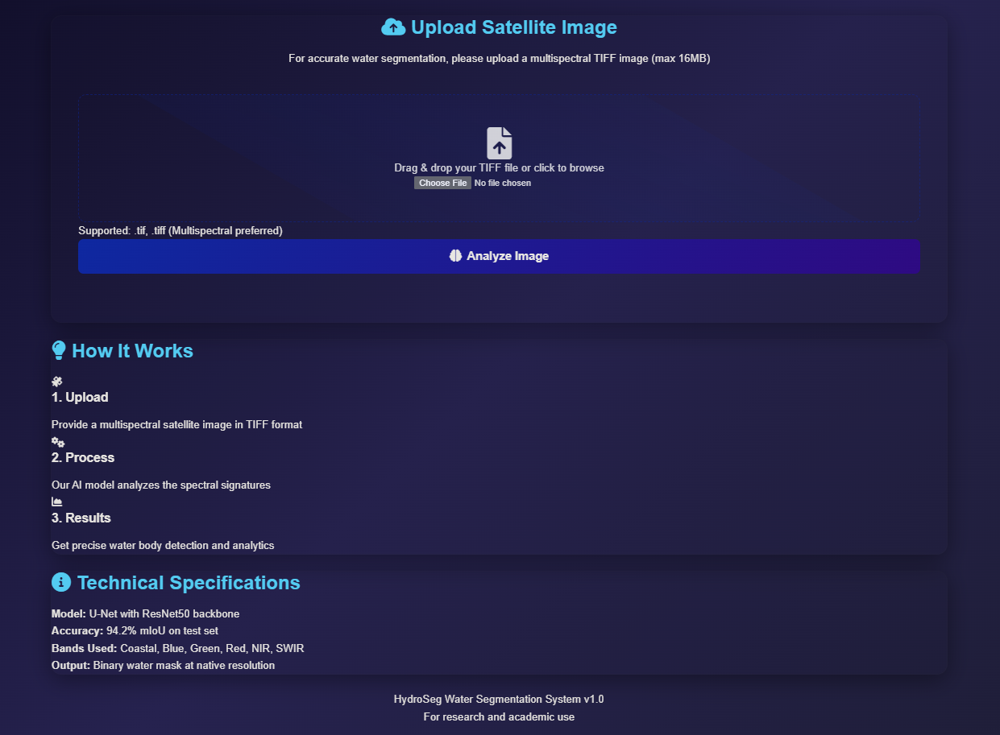
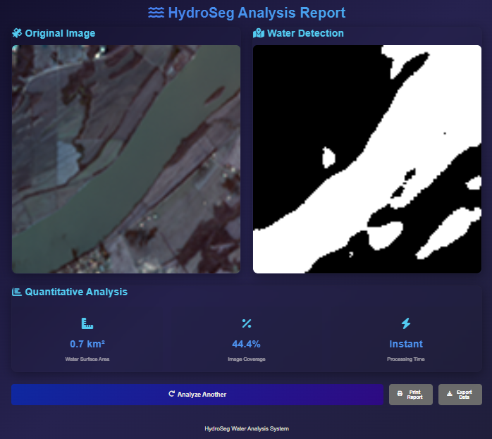

# 🌊 Water Segmentation: Advanced Image Processing with U-Net

## 📌 Overview

**Water Segmentation** is a deep learning project that leverages the U-Net convolutional neural network to accurately segment water bodies from satellite or aerial imagery. This has critical applications in environmental monitoring, hydrology, disaster response, and autonomous systems. Traditional image processing techniques often struggle with the visual complexity of water—due to lighting variations, reflections, and turbidity—making deep learning a more robust solution.

U-Net, originally developed for biomedical image segmentation, is well-suited to this task due to its precision in pixel-level classification and its ability to learn spatial hierarchies even from relatively small datasets.

## 🔧 Model Variants

This project offers multiple model configurations for different data types:

### **Standard U-Net Model**
- **Location**: `U-net/water_segmentation_unet.ipynb`
- **Input**: Multi-channel satellite/aerial imagery
- **Architecture**: Classic U-Net with encoder-decoder structure

### **3-Channel RGB Model**
- **Location**: `3 channels/water-segmentation-pretrained.ipynb`
- **Input**: Standard RGB images (3 channels)
- **Use Case**: Natural photography, drone imagery

### **7-Channel Multi-spectral Model**
- **Location**: `3 channels/water-segmentation-pretrained 7 channels.ipynb`
- **Input**: Multi-spectral satellite data (7 channels)
- **Use Case**: Advanced remote sensing applications

### **Pre-trained Weights**
- **Location**: `flask_app/model/best_model.keras`
- **Format**: Keras saved model format
- **Ready**: For immediate inference and deployment

---

## ✨ Key Features

- 🔬 **U-Net Architecture:** Powerful encoder-decoder CNN with skip connections for precise pixel-level segmentation.
- 📈 **Deep Learning-Based:** Learns complex visual features of water bodies from training data.
- 🌐 **Flask Web App:** Lightweight and interactive web interface for uploading images and visualizing segmentation results.
- 🧠 **Pre-trained Models:** Easily test the project without training from scratch.
- 🐍 **Python Implementation:** Built entirely in Python for easy customization and extensibility.

---

## 🧰 Technologies Used

| Category          | Tools & Libraries                                             |
|-------------------|---------------------------------------------------------------|
| Deep Learning     | TensorFlow, Keras (via `tf.keras`), segmentation_models       |
| Web Deployment    | Flask, Werkzeug                                               |
| Image Processing  | Pillow, OpenCV, `tifffile`                                    |
| Numerical Ops     | NumPy                                                         |
| Visualization     | Matplotlib                                                    |

---

## 🚀 Installation

Follow the steps below to set up the project locally:

1. **Clone the Repository**
   ```bash
   git clone https://github.com/gamal1osama/Water-Segmentation.git
   cd Water-Segmentation
   ```

2. **Create a Virtual Environment**
   ```bash
   python -m venv venv
   # Activate it:
   # On Windows:
   venv\Scripts\activate
   # On Linux/macOS:
   source venv/bin/activate
   ```

3. **Install Dependencies**
   ```bash
   pip install -r requirements.txt
   ```

---

## 📁 Project Structure

```
Water-Segmentation/
├── U-net/
│   └── water_segmentation_unet.ipynb    # U-Net model implementation notebook
├── flask_app/
│   ├── __pycache__/
│   │   └── utils.cpython-311.pyc
│   ├── model/
│   │   └── best_model.keras             # Trained model weights
│   ├── static/
│   │   ├── pred_mask.png               # Generated prediction masks
│   │   ├── rgb.png                     # RGB visualization
│   │   └── style.css                   # Web interface styling
│   ├── templates/
│   │   ├── index.html                  # Main web interface
│   │   └── result.html                 # Results display page
│   ├── uploads/                        # User uploaded images
│   ├── app.py                          # Flask application main file
│   └── utils.py                        # Utility functions
├── pretrained_models/                   # Pre-trained model storage
│   ├── 3 channels/
│   │   └── water-segmentation-pretrained.ipynb     # 3-channel model notebook
│   └── water-segmentation-pretrained 7 channels.ipynb  # 7-channel model
├── .gitattributes                      # Git configuration
└── requirements.txt                    # Python dependencies
```

---

## 🧪 Usage

### 🔧 Running the Flask Application

1. **Navigate to the Flask app directory:**
   ```bash
   cd flask_app
   ```

2. **Set the Flask app environment variable:**
   ```bash
   # On Linux/macOS:
   export FLASK_APP=app.py
   # On Windows:
   set FLASK_APP=app.py
   ```

3. **Run the app:**
   ```bash
   flask run
   ```

Open your browser at `http://127.0.0.1:5000` to access the web interface. You can upload `.tif` images and view the segmented results in real time.

#### 📸 Web Interface Demo

**Upload Interface:**


The web application provides a user-friendly interface for uploading multispectral TIFF images (max 16MB) with drag-and-drop functionality. The system supports various formats with multispectral data preferred for optimal accuracy.

**Analysis Results:**


After processing, the HydroSeg Analysis Report displays:
- **Original Image**: Input satellite/aerial imagery
- **Water Detection**: Binary segmentation mask (white = water, black = land)
- **Quantitative Analysis**: 
  - Water surface area calculation (km²)
  - Image coverage percentage
  - Instant processing time
- **Export Options**: Download results and analysis data


### 🧠 Using the U-Net Model for Research/Development

The project includes multiple model implementations for different use cases:

#### **Jupyter Notebook Implementation**
- **Main U-Net Model**: `U-net/water_segmentation_unet.ipynb` - Core implementation
- **3-Channel Model**: `3 channels/water-segmentation-pretrained.ipynb` - RGB image processing
- **7-Channel Model**: `3 channels/water-segmentation-pretrained 7 channels.ipynb` - Multi-spectral data

#### **Pre-trained Models**
Load pre-trained models directly:

```python
import tensorflow as tf
from tensorflow.keras.models import load_model

# Load the best trained model
model = load_model('flask_app/model/best_model.keras')

# For inference
prediction = model.predict(input_image)
```

#### **Flask Integration**
The Flask app includes utility functions in `flask_app/utils.py` for:
- Image preprocessing
- Model inference
- Result visualization

---

## 🧬 U-Net Architecture Summary

U-Net is designed for high-precision segmentation tasks. Its main components:

- **Encoder-Decoder Structure:** Captures high-level features and restores spatial resolution.
- **Skip Connections:** Pass low-level spatial details directly from encoder to decoder, improving boundary accuracy.
- **End-to-End Training:** Efficient and effective even on limited datasets.

This architecture enables the model to distinguish water from surrounding features with high accuracy, despite environmental variations.

---


## 🤝 Contributing

We welcome community contributions! To contribute:

1. **Fork the repository.**

2. **Create a new branch:**
   ```bash
   git checkout -b feature/your-feature-name
   ```

3. **Make your changes, test them, and commit:**
   ```bash
   git commit -m "feat: Describe your change here"
   ```

4. **Push your branch:**
   ```bash
   git push origin feature/your-feature-name
   ```

5. **Open a Pull Request** on GitHub and describe your changes clearly.

---

## 📬 Contact

**Gamal Osama**  
AI Engineer | Deep Learning Enthusiast  
🔗 [GitHub](https://github.com/gamal1osama) | ✉️ Feel free to connect for collaboration!

---

